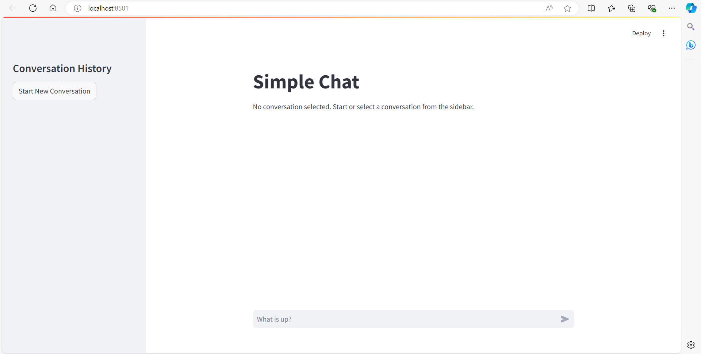
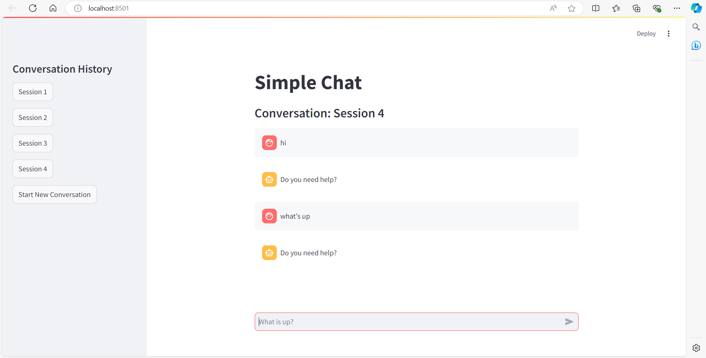

# 🤖 ChatGPT Clone with Streamlit

Welcome to the **ChatGPT Clone** project! This clone is built using [Streamlit](https://streamlit.io/) and mimics the popular ChatGPT interface. It allows you to have multiple chat sessions, all conveniently stored in a collapsible sidebar. 🗂️💬

## 🚀 Preview

### 1. Blank Chat Page (Upon Loading)


> 📝 **Tip**: You can access the **dark mode** by clicking the settings icon on the top right of the page.

### 2. Chat Sessions Loaded on Sidebar


> 📝 **Tip**: The sidebar is **collapsible**, giving you a clean, minimal chat interface while still allowing easy access to all past conversations.

---

## ✨ Features

- 🧠 Dynamic chat interface resembling ChatGPT
- 📂 Multiple chat sessions saved in a collapsible sidebar
- 🖥️ Responsive and user-friendly interface

---

## ⚙️ How to Run Locally

### Prerequisites

1. Make sure you have [Python](https://www.python.org/downloads/) installed on your machine. 🐍
2. Install [Streamlit](https://streamlit.io/) and other necessary dependencies.

### Setup Instructions

1. **Clone the Repository** 🛠️
   ```bash
   git clone https://github.com/harshitsingh09/ChatGPT-clone.git
   cd ChatGPT-clone
   ```

2. **Create a Virtual Environment** 🌐
   ```bash
   python -m venv venv
   source venv\Scripts\activate #iOS users : venv/bin/activate
   ```

3. **Install Dependencies** 📦
   ```bash
   pip install -r requirements.txt
   ```

4. **Run the Application** 🏃‍♂️
   ```bash
   streamlit run main.py
   ```

### Viewing the Application

Once the application is running, open [http://localhost:8501](http://localhost:8501) in your web browser. You’ll see the chat interface with a collapsible sidebar where all chat sessions are stored. 💻✨

---

## 🤝 Contributing

Contributions are welcome! If you'd like to suggest changes or improvements, feel free to open an issue or submit a pull request. 🚀

---

## 📜 License

This project is licensed under the MIT License - see the [LICENSE](LICENSE) file for details.

---

If you find this project helpful, don’t forget to give it a ⭐️! Your support is much appreciated. 😊✨
